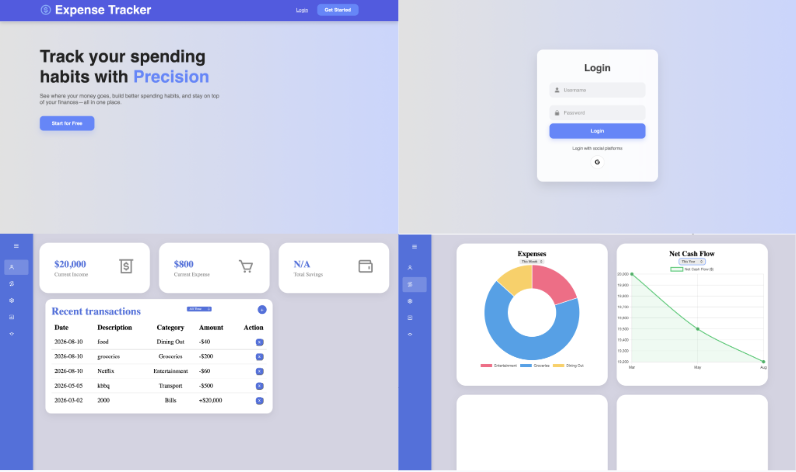

# Expense Tracker

Track your spending habits with precision.

🔗 **Live Demo:** [expense-tracker-web-app](https://vincenttrinh9098.github.io/expense-tracker-web-app/)

## About

Expense Tracker is a simple, browser-based tool for keeping tabs on where your money goes. Log expenses, see your monthly spending trends, and understand your net cash flow at a glance.

## Features

- **Add Expenses** — Quickly log individual expenses as they happen
- **Monthly Spending Tracking** — Visualize how your spending changes month to month
- **Net Cash Flow** — See the bigger picture of money in vs. money out
- **User Authentication** — Secure sign-in powered by Firebase
- **Interactive Charts** — Visual breakdowns of your spending via Chart.js

## Tech Stack

- **JavaScript** — Core application logic
- **HTML/CSS** — Structure and styling
- **Firebase** — Authentication
- **Chart.js** — Data visualization

## Getting Started

No setup required — just visit the live site and start tracking:

👉 [https://vincenttrinh9098.github.io/expense-tracker-web-app/](https://vincenttrinh9098.github.io/expense-tracker-web-app/)

## License

None
